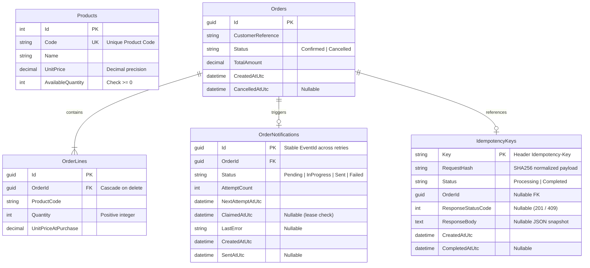
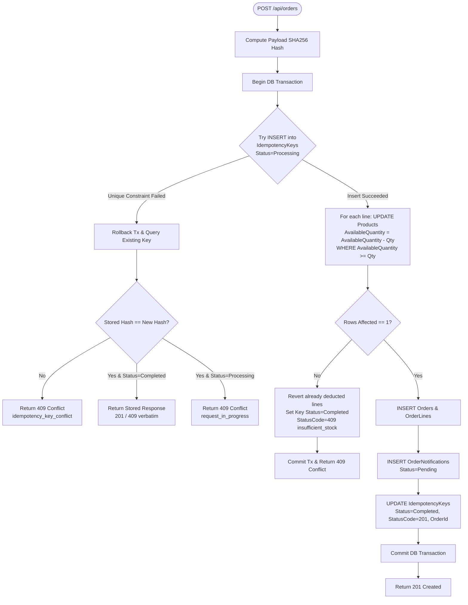
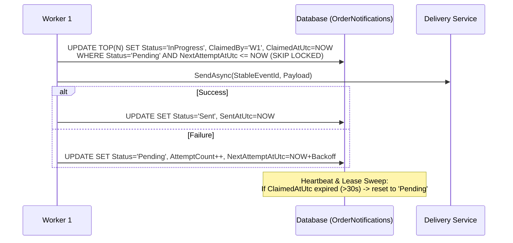

# Design Note: Concurrent Order Processing

## 1. Database Schema & ER Diagram

---

## 2. Order Creation & Idempotency Flow

Everything runs inside **one atomic database transaction**:

---

## 3. Core Architecture Highlights

### A. Concurrency & Transactions
- **No Process-Local Locks**: Concurrency is enforced by database atomic conditional updates (`UPDATE Products ... WHERE AvailableQuantity >= @qty`) and relational unique keys (`PK on IdempotencyKeys.Key`).
- **All-in-One Transaction**: Idempotency claim, stock deduction, order record, and notification row share a single transaction. If a crash occurs before commit, the claim is rolled back completely—preventing ghost "stuck" records without distributed 2PC.
- **SQLite Concurrency Model**: SQLite uses single-writer serialized writes with a 5-second busy timeout (`Default Timeout=5`). Concurrent writes queue briefly; if the timeout expires, `409 request_in_progress` is returned. On PostgreSQL/SQL Server, this path is hit directly without waiting.

### B. Order Cancellation (Idempotent)
- Conditional atomic update: `UPDATE Orders SET Status='Cancelled' WHERE Id=@id AND Status='Confirmed'`.
- Only if exactly **1 row is updated** is inventory restored.
- If **0 rows are updated**, the system re-reads the order: if already `Cancelled`, it returns 200 idempotently without double-restoring stock; if missing, returns 404.

---

## 4. Extensions & Future Architecture (Design-Only)

### A. Multi-Worker Notification Scaling

- **At-Least-Once Delivery**: Handled downstream by idempotency consumers keyed on the stable `EventId` (`OrderNotifications.Id`).

### B. Real Payment Gateway (Decoupled Network Call)
- **Do not hold DB transactions over HTTP calls**:
  1. Transaction 1: Reserve stock and save order as `PendingPayment`. Commit immediately.
  2. Outside transaction: Call payment provider with idempotent `PaymentIntentId`.
  3. Transaction 2: On payment success, update order to `Confirmed`.
  4. Background reconciliation job checks stuck `PendingPayment` orders against the payment gateway API to either finalize or release reserved stock.

---

## 5. Minimum Telemetry (Logs & Metrics)

| Telemetry Type | Name | Purpose |
|---|---|---|
| **Structured Log** | `StockConflict` | Alert when stock is exhausted (product, requested, available). |
| **Structured Log** | `IdempotencyKeyConflict` | Track payload tampering with reused keys. |
| **Structured Log** | `NotificationExhausted` | Alert operations when a delivery permanently fails. |
| **Metric Counter** | `orders_stock_conflict_total` | Business metric for inventory sizing. |
| **Metric Counter** | `orders_idempotency_duplicate_total` | Network/client retry volume. |
| **Metric Gauge** | `pending_notification_oldest_age_seconds` | SLA monitoring for notification worker backlog. |
